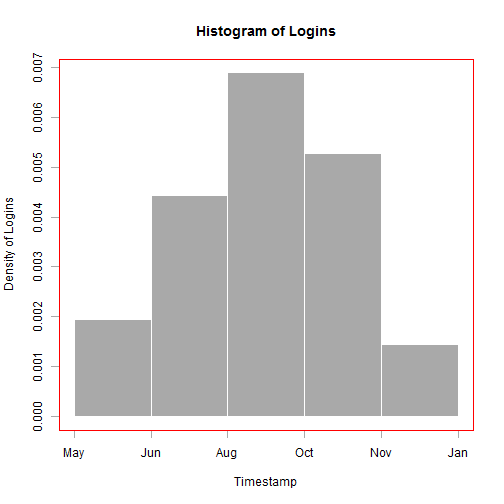

Reproducible Pitch Presentation
========================================================
author: Steven Rankine
date:   21 December 2014


Overview
========================================================

Developed a User Analysis Shiny application that can be used to understand how users are connecting to a web application. This feedback can be used for the following.

- Understand peak usage
- Optimize Web Application for most users
- Identify cyclical and seasonal trends
- Potential for real-time updates and analysis

Link to application: http://sdr4w.shinyapps.io/ShinyApp/

Code from server.R
========================================================

```
            timestamp userBrowser userPlatform
1 2012-02-06 10:06:35     Unknown      Unknown
2 2012-02-06 11:43:02     Unknown      Unknown
3 2012-02-06 12:06:55     Unknown      Unknown
4 2012-02-06 12:10:02     Unknown      Unknown
5 2012-02-06 13:07:33     Unknown      Unknown
6 2012-02-06 14:05:11     Unknown      Unknown
```

Code from server.R
========================================================


Slide With Plot
========================================================

 
