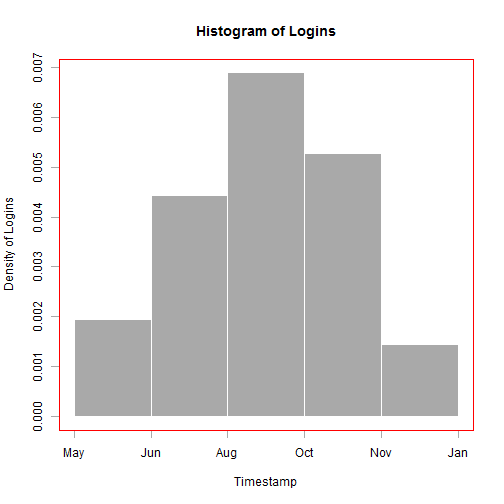

Reproducible Pitch Presentation
========================================================
author: Steven Rankine
date:   21 December 2014

First Slide
========================================================

The User Analysis Shiny application can be used to understand how users are connecting to a web application. This feedback can be used for the following.

- Understand peak usage
- Optimize Web Application for most users
- Bullet 3

Slide With Code
========================================================


```r
library(shiny);
library(RODBC);
library(sqldf);
library(ggplot2);

ch <- odbcConnect("MySQL CFBLNet");
df <- sqlQuery(ch,"SELECT timestamp,userBrowser,userPlatform,actionType FROM _log WHERE actionSubType='LOGIN'");
odbcClose(ch);
str(df);
```

```
'data.frame':	4123 obs. of  4 variables:
 $ timestamp   : POSIXct, format: "2012-02-06 10:06:35" "2012-02-06 11:43:02" ...
 $ userBrowser : Factor w/ 4 levels "","Google Chrome",..: 1 1 1 1 1 1 1 1 1 1 ...
 $ userPlatform: Factor w/ 3 levels "","mac","windows": 1 1 1 1 1 1 1 1 1 1 ...
 $ actionType  : Factor w/ 2 levels "","ACCESS": 2 2 2 2 2 2 2 2 2 2 ...
```

Slide With Plot
========================================================

 
